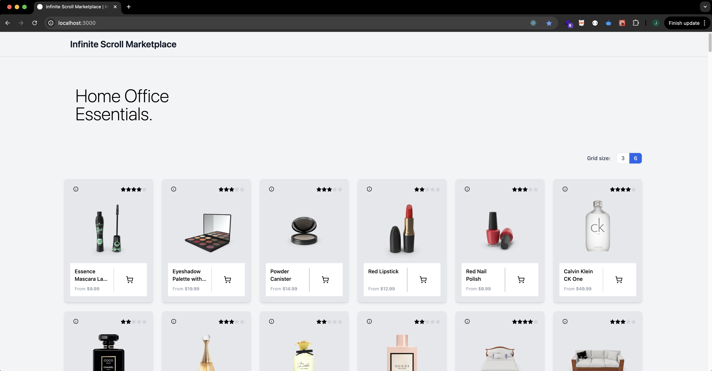
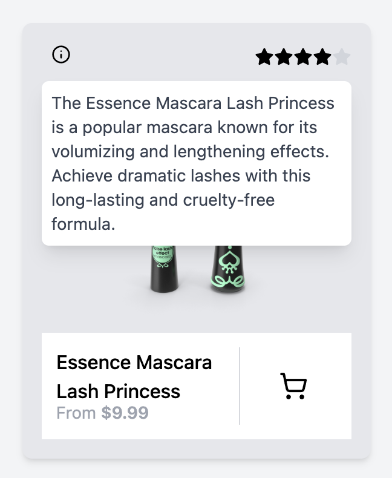
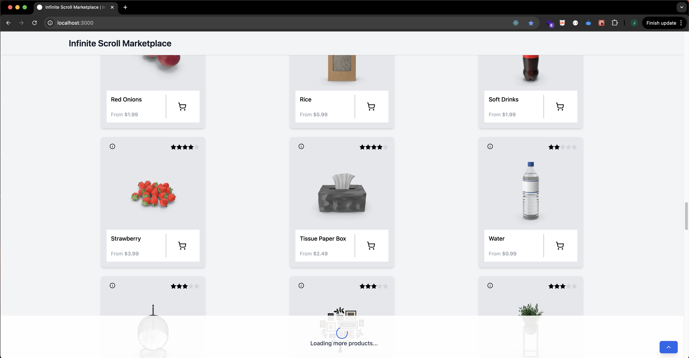
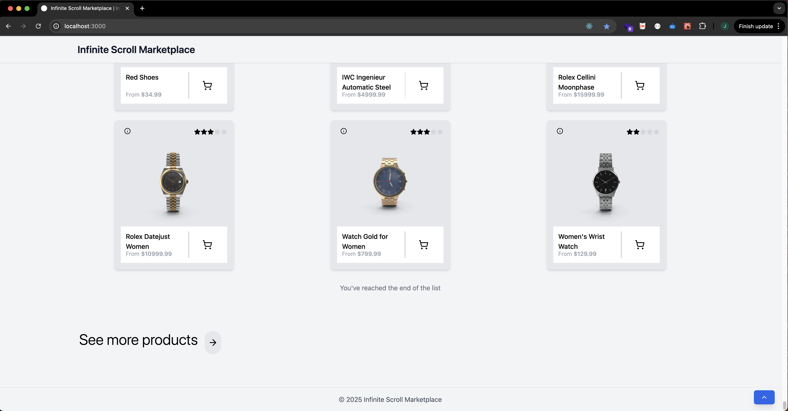

# S-Infinite-S

A React-based application using TypeScript and Vite.

## Table of Contents

- [Features](#features)
- [Tech Stack](#tech-stack)
- [Getting Started](#getting-started)
  - [Prerequisites](#prerequisites)
  - [Installation](#installation)
- [Usage](#usage)
- [Development Workflow](#development-workflow)
  - [Common Commands](#common-commands)
  - [Branch Naming Strategy](#branch-naming-strategy)
  - [Git Workflow](#git-workflow)
- [Project Architecture](#project-architecture)
- [Project Structure](#project-structure)
- [Environment Management](#environment-management)
- [Continuous Integration & Deployment](#continuous-integration--deployment)
- [Code Quality & Standards](#code-quality--standards)
- [Testing](#testing)
  - [Test Categories](#test-categories)
  - [CI Integration](#ci-integration)
  - [Test Documentation](#test-documentation)
  - [Future Testing Improvements](#future-testing-improvements)
- [SEO & Metadata](#seo-&-metadata)
- [Considerations](#considerations)
  - [Infinite Scroll Approach](#infinite-scroll-approach)

## Features

- Infinite scroll for dynamic content loading
- Responsive design with 3-column card layout
- Loading indicators for improved user experience
- Environment-specific builds (development, staging, production)

## Tech Stack

- **React**: UI Library (v18.3.1)
- **TypeScript**: Type Safety (v5.5.3)
- **Tailwind CSS**: Styling (v3.4.12)
- **Vite**: Build optimization (v5.4.1)
- **React Helmet**: Document head management (v6.1.0)
- **ESLint & Prettier**: Code quality and formatting
- **PNPM**: Package manager (v9.8.0)
- **Simple Git Hooks**: Git automation
- **Standard Version**: Semantic versioning
- **GitHub Actions**: CI/CD pipeline

## Getting Started

### Prerequisites

- Node.js (latest LTS version recommended)
- PNPM v9.8.0

### Installation

1. Clone the repository:

   ```bash
   git clone git@github.com:JAE-S/s-infinite-s.git
   cd s-infinite-s
   ```

2. Install dependencies:

   ```bash
   pnpm install
   ```

3. Start the development server:

   ```bash
   pnpm dev
   ```

4. Open [http://localhost:3000](http://localhost:3000) in your browser

## Usage

The Infinite Scroll Marketplace provides a seamless shopping experience with dynamically loaded products as you scroll through the catalog.

The application displays a clean, modern interface with the "Home Office Essentials" heading prominently displayed at the top.



### Key Features

#### Product Grid Layout

Products are displayed in a responsive grid layout that adapts to different screen sizes:

- Toggle between 3-column and 6-column layouts using the grid size selector in the top right
- Each product card shows:
  - Product image
  - Star rating (out of 5)
  - Product name
  - Price
  - Add to cart button

#### Product Details

Hovering over the information icon on a product card reveals additional product details:

<div align="left">
  
</div>

#### Infinite Scroll

The application automatically loads more products as you scroll down:

- A loading indicator appears at the bottom of the page when new products are being fetched



#### End of the list

- "You've reached the end of the list" message appears when all products have been loaded



#### Navigation

- Use the "See more products" button at the bottom to load additional products
- A scroll-to-top button appears when scrolling down, allowing quick navigation back to the top of the page

### Accessibility Features

The application is built with accessibility in mind:

- All product images have appropriate alt text
- Semantic HTML structure for better screen reader navigation
- Skip to content link for keyboard users

### Responsive Design

The application adapts seamlessly to different screen sizes:

- Desktop: 3 or 6 column layouts depending on user preference
  - Note: slight ui bug on smaller screens when 6 columns are selected
- Mobile: Single column layout for the best mobile experience

## Development Workflow

### Common Commands

```bash
# Development
pnpm dev                 # Start development server
pnpm build:dev           # Build for development environment
pnpm build:staging       # Build for staging environment
pnpm build               # Build for production

# Code Quality
pnpm lint                # Check for linting issues
pnpm lint:fix            # Fix linting issues
pnpm format              # Format code with Prettier
pnpm type-check          # Type check TypeScript code
pnpm organize-imports    # Organize import statements

# Testing
pnpm test:smoke          # Run smoke tests only
pnpm test:accessibility  # Run accessibility tests only
pnpm test:seo            # Run SEO tests only
pnpm test                # Run all tests
pnpm test:watch          # Run tests in watch mode
pnpm test:ui             # Run tests with UI
pnpm test:coverage       # Generate coverage report

# Utilities
pnpm clean               # Remove build artifacts and node_modules
```

### Branch Naming Strategy

This project uses a standardized branch naming convention to maintain clarity and organization in our repository.

**Basic Format:**

```
<prefix>/<ticket-number>-<descriptive-name>
```

**Common prefixes:**

- `feature/` or `feat/`: New features
- `fix/`: Bug fixes
- `hotfix/`: Urgent production fixes
- `release/`: Release preparation
- `chore/`: Maintenance tasks
- `docs/`: Documentation updates

For a complete guide on branch naming conventions, see [branch-naming-guide.md](.github/branch-naming_guide.md).

### Git Workflow

This project follows [Conventional Commits](https://www.conventionalcommits.org/) for commit messages. A commit template is automatically applied when you create a new commit.

**Basic Structure:**

```
<type>(<scope>): <short summary>
```

**Common types:**

- `feat`: A new feature
- `fix`: A bug fix
- `docs`: Documentation changes
- `style`: Formatting changes
- `refactor`: Code changes without adding features or fixing bugs
- `perf`: Performance improvements

For more details, see [commit_guide.md](.github/commit_guide.md).

## Project Architecture

This project follows modern React architecture that combines elements of several patterns to create a maintainable structure.

- **Feature-Based Organization**: Components are structured around their functional purpose, with clear separation between reusable UI elements and page-specific views.
- **Component Composition**: The application uses a hierarchy of component types (layouts, views, components) that compose together to create complete interfaces.
- **View/Container Pattern**: Separation between container components and presentational components.

## Project Structure

```
s-infinite-s/
├── .github/                              # GitHub configuration
│   ├── templates                         # Templates for standardized formats
│   │   └── commit-template.txt           # Standard format for Git commit messages
│   ├── workflows                         # GitHub Actions workflow definitions
│   │   ├── auto-version.yml              # Automated version bumping workflow
│   │   ├── development.yml               # CI/CD pipeline for the development environment
│   │   ├── production.yml                # CI/CD pipeline for the production environment
│   │   ├── promote.yml                   # Workflow for promoting code between environments
│   │   ├── setup-labels.yml              # Workflow to set up standardized issue/PR labels
│   │   ├── shared-checks.yml             # Common checks used across different workflows
│   │   └── staging.yml                   # CI/CD pipeline for the staging environment
│   ├── environments.yml                  # Environment configurations and variables
│   ├── labels.json                       # Definitions for custom GitHub issue/PR labels
│   ├── promotion_guide.md                # Documentation on how to promote code between environments
│   ├── pull-request_template.md          # Template displayed when creating new pull requests
│   └── versioning_guide.md               # Guidelines for version numbering and management
├── .github/                              # Custom scripts
│   ├── organize-imports.cjs              # Automatically formats import statements in TypeScript/React files by grouping and ordering them according to a predefined standard pattern
│   └── setup-git-template.cjs            # Sets up Git commit message templates by copying from .github/templates/commit-template.txt to provide standardized commit formatting
├── src/
│   ├── assets/                           # Images, styling, fonts, etc.
│   ├── components/                       # Reusable UI components
│   │   ├── buttons/                      # Button components
│   │   │   └── __tests__/                # Button-specific tests
│   │   ├── cards/                        # Card components
│   │   │   └── __tests__/                # Card-specific tests
│   │   └── icons/                        # Icon components
│   │       └── __tests__/                # Icon-specific tests
│   ├── layouts/                          # Layout components
│   │   └── __tests__/                    # Layout-specific tests
│   ├── store/                            # Store setup
│   ├── test/                             # Test configuration and utilities
│   │   ├── mocks/                        # Mock data and mock functions
│   │   ├── results/                      # Test result reports
│   │   ├── test_implementation-guide.md  # Guide for writing tests
│   │   └── setup.ts                      # Test setup configuration
│   ├── types/                            # TypeScript type definitions
│   ├── utils/                            # Utility functions
│   ├── views/                            # Features and feature-specific components
│   │   └── home/                         # Home essentials feature
│   │       ├── __tests__/                # Home essentials-specific tests
│   │       ├── components/               # Home essentials-specific components
│   │       └── home-dashboard_view.tsx
│   ├── App.tsx                           # Main App component
│   ├── App.css                           # Global styles
│   └── main.tsx                          # Application entry point
├── vite.config.js                        # Vite configuration
├── ...env files                          # Environment config files
└── ...config files
```

## Environment Management

The application supports three environments:

1. **Development** - For active development work

   - Branch: `development`
   - Version format: `1.2.3-dev.1`

2. **Staging** - For pre-production testing

   - Branch: `staging`
   - Version format: `1.2.3-rc.1`

3. **Production** - For production deployment
   - Branch: `production` (with `main` as a mirror)
   - Version format: `1.2.3`

### Environment Configuration

Set up environment-specific configuration by copying the example files:

```bash
# Development environment
cp .env.development.example .env.development

# Staging environment
cp .env.staging.example .env.staging

# Production environment
cp .env.production.example .env.production
```

Each environment has its own configuration file with appropriate settings for that environment. Edit these files to customize environment-specific variables.

For more details on promoting code between environments, see [promotion_guide.md](.github/promotion_guide.md).

## Continuous Integration & Deployment

This project uses GitHub Actions for CI/CD:

- **Shared Checks** - Runs linting, type checking, and testing on all branches
- **Environment-Specific Builds** - Separate workflows for development, staging, and production
- **Promotion Workflow** - Handles promoting code between environments
- **Version Management** - Automatically determines version increments based on PR labels

For detailed information about test automation, see [test-automation_guide.md](.github/test-automation_guide.md).
For detailed information about versioning, see [versioning_guide.md](.github/versioning_guide.md).

## Code Quality & Standards

Code quality is maintained through:

- **TypeScript** for type safety
- **ESLint** for code linting (v9.9.0)
- **Prettier** for code formatting (v3.3.3)
- **Simple Git Hooks** for pre-commit checks:
  - Linting
  - Type checking
  - Commit message validation
- **Import Organization** - Standardized import ordering using a custom script

## Testing

This project uses Vitest for testing with Jest-compatible APIs, focusing on comprehensive test coverage across different test categories.

### Test Categories

Our tests are organized into distinct categories:

- **Smoke Tests**: Verify that core functionality works correctly

  - Run in all environments (development, staging, production)
  - Focus on critical paths and essential features

- **Accessibility Tests**: Ensure components meet WCAG standards

  - Run in staging and production environments
  - Use jest-axe for automated accessibility checking

- **SEO Tests**: Verify proper SEO attributes and structured data
  - Run in production environment only
  - Test meta tags, structured data, and other SEO elements

### CI Integration

Tests are automatically run as part of the CI/CD pipeline, with different test categories running in different environments:

- **Development**: Smoke tests
- **Staging**: Smoke tests + Accessibility tests
- **Production**: Smoke tests + Accessibility tests + SEO tests + Coverage

All tests must pass before code can be merged or deployed to any environment.

### Test Documentation

For more detailed information about our testing approach:

- **.github/test-automation_guide.md**: Documentation for CI/CD testing workflows[test-automation_guide.md](src/test/test-implementation_guide.md)
- **src/test/test-implementation_guide.md**: Guide for writing and structuring tests[test-implementation_guide.md](src/test/test-implementation_guide.md)

### Future Testing Improvements

- Implement end-to-end (E2E) tests
- Increase test coverage for complex interactions
- Add integration tests for Redux store and API interactions
- Implement more robust testing for error handling, api security, performance etc.

## SEO & Metadata

This project implements robust SEO optimization through React Helmet and structured data that follows Schema.org standards.

### React Helmet

React Helmet is used throughout the application to manage document head content, including:

- Page titles and meta descriptions
- OpenGraph and Twitter meta tags
- Canonical URLs
- Structured data (JSON-LD)

#### Implementation

React Helmet is integrated into:

- Individual product cards for product-specific structured data
- Page components for page-level metadata
- Layout components for site-wide defaults

## Considerations

### Infinite Scroll Approach

The current implementation uses a balanced approach to infinite scrolling that combines the simplicity of local state management with the power of RTK Query optimizations.

Key aspects of this approach include:

1. **Progressive Loading** - Using two Intersection Observers at different distances from the bottom to create a seamless loading experience:

   - A preloader observer (500px from bottom) that triggers data fetching before the user reaches the end
   - A main loader observer (200px from bottom) that shows the loading indicator when new data is needed

2. **Efficient Data Management** - Combining local React state with RTK Query:

   - Local state provides reliable control over the rendered product list
   - RTK Query handles caching, data normalization, and network optimization
   - Immutable data patterns via RTK's Immer integration ensure predictable state updates and optimal rendering performance

3. **Performance Optimizations**:

   - Component memoization to prevent unnecessary re-renders
   - Debounced loading functions to prevent duplicate API calls
   - Transparent loading indicator that appears only when needed

4. **Enhanced Backend Integration**:
   - Offset-based pagination (skip/limit) for the current implementation
   - Short-lived cache (1 minute) for data freshness
   - Custom cache key serialization for better hit rates
   - Data normalization at the API level

This hybrid approach provides excellent performance for current requirements while maintaining the flexibility to implement more advanced optimizations as the marketplace scales.

#### Future Scaling Options

For larger-scale deployments, consider exploring:

- **Virtualized Lists** - Libraries like `react-window` or `react-virtualized` to render only visible items
- **Windowing Techniques** - Automatically remove off-screen items from the DOM to reduce memory usage
- **Web Workers** - Offloading heavy computations to separate threads for smoother scrolling
- **Cursor-based Pagination** - Using references to the last loaded item rather than offset positions, which is more efficient for large, dynamic datasets and avoids the "skipped item" problem when items are added or removed
